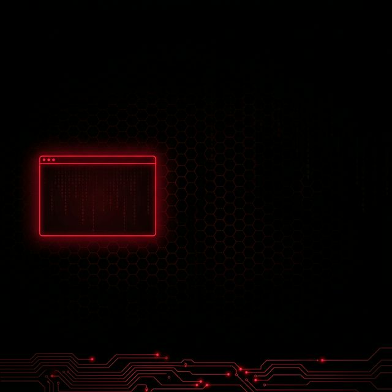

<div align="center">

<!-- HEADER BANNER -->


<br/>

<!-- TYPING ANIMATION -->
<a href="https://git.io/typing-svg">
  
</a>

<br/>

<!-- VISITOR BADGE + PROFILE VIEWS -->

&nbsp;
<a href="https://github.com/Red0psD3v4rsh007?tab=followers">
  
</a>

<br/><br/>

<!-- SOCIAL BADGES -->
<a href="https://www.linkedin.com/in/devarshdalwadi">
  
</a>
&nbsp;
<a href="https://github.com/Red0psD3v4rsh007">
  
</a>

</div>

<br/>

<!-- DIVIDER -->


## `> whoami`

```bash
┌──(devarsh㉿red0ps)-[~/about]
└─$ cat identity.txt

  ╔══════════════════════════════════════════════════════════════╗
  ║                                                              ║
  ║   Name     : Devarsh                                         ║
  ║   Alias    : Red0ps                                          ║
  ║   Role     : Offensive Security Operator                     ║
  ║   Focus    : Penetration Testing | Red Teaming               ║
  ║   Mission  : Break it. Report it. Fix it.                    ║
  ║                                                              ║
  ║   "I don't find bugs. I find entry points."                  ║
  ║                                                              ║
  ╚══════════════════════════════════════════════════════════════╝
```

<br/>

## `>cat /etc/current_ops.conf`

```yaml
# ============================================
# ACTIVE OPERATIONS — CLASSIFIED
# ============================================

current_focus:
  - target: "Web Application Pentesting"
    status: "ACTIVE"
    scope: "OWASP Top 10 | API Security | Auth Bypass"

  - target: "Active Directory Exploitation"
    status: "ACTIVE"
    scope: "Kerberoasting | Priv Esc | Lateral Movement"

  - target: "Pentra Platform Development"
    status: "IN PROGRESS"
    scope: "Autonomous Offensive Security Engine"

  - target: "Automation & Tooling"
    status: "ONGOING"
    scope: "Python/Bash Recon Scripts | Custom Exploit Dev"

  - target: "CTF Competitions"
    status: "CONTINUOUS"
    scope: "pwn | web | forensics | crypto"
```

<br/>


## `> ls -la /opt/arsenal/`

<div align="center">

### ⚔️ Offensive Arsenal

<table>
<tr>
<td align="center" width="120">
<br/>
<sub><b>Nmap</b></sub>
</td>
<td align="center" width="120">
<br/>
<sub><b>Burp Suite</b></sub>
</td>
<td align="center" width="120">
<br/>
<sub><b>Metasploit</b></sub>
</td>
<td align="center" width="120">
<br/>
<sub><b>sqlmap</b></sub>
</td>
<td align="center" width="120">
<br/>
<sub><b>Wireshark</b></sub>
</td>
</tr>
<tr>
<td align="center" width="120">
<br/>
<sub><b>Impacket</b></sub>
</td>
<td align="center" width="120">
<br/>
<sub><b>Responder</b></sub>
</td>
<td align="center" width="120">
<br/>
<sub><b>CrackMapExec</b></sub>
</td>
<td align="center" width="120">
<br/>
<sub><b>Hydra</b></sub>
</td>
<td align="center" width="120">
<br/>
<sub><b>John</b></sub>
</td>
</tr>
<tr>
<td align="center" width="120">
<br/>
<sub><b>Nuclei</b></sub>
</td>
<td align="center" width="120">
<br/>
<sub><b>Dalfox</b></sub>
</td>
<td align="center" width="120">
<br/>
<sub><b>Semgrep</b></sub>
</td>
<td align="center" width="120">
<br/>
<sub><b>TruffleHog</b></sub>
</td>
<td align="center" width="120">
<br/>
<sub><b>BloodHound</b></sub>
</td>
</tr>
</table>

<br/>

### 🖥️ Dev & Infrastructure

<table>
<tr>
<td align="center" width="96">
<br/>
<sub><b>Python</b></sub>
</td>
<td align="center" width="96">
<br/>
<sub><b>Bash</b></sub>
</td>
<td align="center" width="96">
<br/>
<sub><b>JavaScript</b></sub>
</td>
<td align="center" width="96">
<br/>
<sub><b>TypeScript</b></sub>
</td>
<td align="center" width="96">
<br/>
<sub><b>Next.js</b></sub>
</td>
<td align="center" width="96">
<br/>
<sub><b>FastAPI</b></sub>
</td>
</tr>
<tr>
<td align="center" width="96">
<br/>
<sub><b>Docker</b></sub>
</td>
<td align="center" width="96">
<br/>
<sub><b>PostgreSQL</b></sub>
</td>
<td align="center" width="96">
<br/>
<sub><b>Redis</b></sub>
</td>
<td align="center" width="96">
<br/>
<sub><b>Linux</b></sub>
</td>
<td align="center" width="96">
<br/>
<sub><b>Kali</b></sub>
</td>
<td align="center" width="96">
<br/>
<sub><b>Git</b></sub>
</td>
</tr>
</table>

</div>

<br/>


## `> cat /var/log/featured_ops.log`

<div align="center">

<a href="https://github.com/Red0psD3v4rsh007/Pentra">
  
</a>

<br/><br/>

```
╔══════════════════════════════════════════════════════════════╗
║                                                              ║
║   🧪  PENTRA — Autonomous Offensive Security Platform        ║
║   ─────────────────────────────────────────────────           ║
║   AI-powered penetration testing engine with real-time       ║
║   command center UI. Coordinates recon, vuln scanning,       ║
║   exploitation, and AI analysis through distributed          ║
║   microservices. Built with Next.js, FastAPI, Redis,         ║
║   PostgreSQL, and a full worker pipeline.                    ║
║                                                              ║
║   STATUS: ACTIVE DEVELOPMENT 🔴                              ║
║                                                              ║
╚══════════════════════════════════════════════════════════════╝
```

</div>

<br/>


## `> ./recon.sh --stats`

<div align="center">

<!-- GITHUB STATS -->
<a href="https://github.com/Red0psD3v4rsh007">
  
</a>
&nbsp;&nbsp;
<a href="https://github.com/Red0psD3v4rsh007">
  
</a>

<br/><br/>

<!-- STREAK STATS -->
<a href="https://github.com/Red0psD3v4rsh007">
  
</a>

<br/><br/>

<!-- TROPHIES -->
<a href="https://github.com/ryo-ma/github-profile-trophy">
  
</a>

<br/><br/>

<!-- ACTIVITY GRAPH -->
<a href="https://github.com/Red0psD3v4rsh007">
  
</a>

</div>

<br/>


## `> cat /proc/contributions`

<div align="center">

<!-- SNAKE ANIMATION -->
<picture>
  <source media="(prefers-color-scheme: dark)" srcset="https://raw.githubusercontent.com/Red0psD3v4rsh007/Red0psD3v4rsh007/output/github-snake-dark.svg" />
  <source media="(prefers-color-scheme: light)" srcset="https://raw.githubusercontent.com/Red0psD3v4rsh007/Red0psD3v4rsh007/output/github-snake.svg" />
  
</picture>

</div>

<br/>


<div align="center">

### 📡 Connect to the Network

<br/>

<a href="https://www.linkedin.com/in/devarshdalwadi">
  
</a>
&nbsp;&nbsp;
<a href="https://github.com/Red0psD3v4rsh007">
  
</a>
&nbsp;&nbsp;
<a href="mailto:">
  
</a>

<br/><br/>

<!-- CAPSULE RENDER FOOTER -->


<br/>

```
┌──(root㉿red0ps)-[~/session]
└─# echo "Connection established. Welcome, operator."
Connection established. Welcome, operator.
└─# █
```

<sub>⚡ Handcrafted with malicious intent by <a href="https://github.com/Red0psD3v4rsh007">@Red0psD3v4rsh007</a></sub>

</div>
